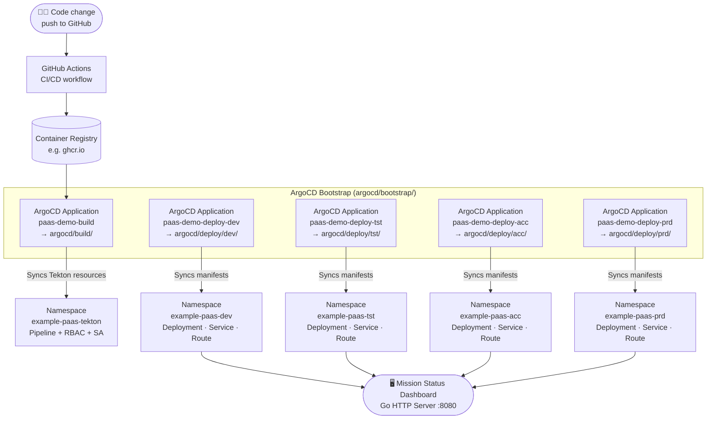

# 🎖️ Defensie Mission Control — OpenShift Demo App

A military-themed Mission Status Dashboard built for a live booth demonstration at the **Ministry of Defence (Ministerie van Defensie)**. It showcases how fast a code change goes from commit to production on OpenShift.

```
┌─────────────────────────────────────────────────────────────────┐
│  MINISTERIE VAN DEFENSIE // OPERATIONEEL CENTRUM                │
│                                                                 │
│  ┌─────────────────────────────────────────────────────────┐   │
│  │         THREAT LEVEL: GREEN                             │   │
│  └─────────────────────────────────────────────────────────┘   │
│                                                                 │
│  ┌──────────────┐  ┌──────────────┐  ┌──────────────────────┐  │
│  │ MISSION      │  │ UNIT STATUS  │  │ ACTIVE OPERATIONS    │  │
│  │ READINESS    │  │ ALPHA-1 ✓    │  │ OP IRON SENTINEL     │  │
│  │    94%       │  │ BRAVO-2 ✓    │  │ OP STEEL HORIZON     │  │
│  │ ████████░░   │  │ CHARLIE-3 ⚠  │  │ OP CYBER SHIELD      │  │
│  └──────────────┘  └──────────────┘  └──────────────────────┘  │
│                                                                 │
│  PLATFORM: OpenShift  │  UPTIME: 2h 14m  │  BUILD: abc1234    │
└─────────────────────────────────────────────────────────────────┘
```

## 🎯 The Demo

Change **one line** of code → push → watch the pipeline deploy → see the dashboard update live.

```go
// internal/config/config.go — change this line:
const ThreatLevel = "GREEN"   // → "AMBER", "RED", or "BLACK"
```

## 🏗️ Architecture

### Demo Flow (actual)

For the demo we pre-build the container image via **GitHub Actions** (see [`.github/workflows/`](.github/workflows/)) and push it to the registry. This keeps the demo snappy — no waiting for an in-cluster build during the limited booth time.



### Full GitOps Flow (with in-cluster Tekton build)

The [`argocd/build/`](argocd/build/) directory contains a **reference Tekton setup** showing how an in-cluster build pipeline would look. It is **not used during the demo** — it is included as an example of how you would wire up Tekton on OpenShift for a real production pipeline.

```
Git Push
   │
   ▼
Tekton Pipeline (on OpenShift)          ← example only (argocd/build/)
   ├── git-clone
   ├── buildah (build + push to registry)
   └── oc rollout (trigger deployment)
         │
         ▼
   ArgoCD (GitOps sync)
         │
         ▼
   OpenShift Deployment (per environment)
         │
         ▼
   Go HTTP Server (port 8080)
   ├── GET /          → Mission Status Dashboard (HTMX + Tailwind CDN)
   ├── GET /metrics   → Prometheus text format
   ├── GET /health    → Liveness probe {"status":"ok"}
   └── GET /ready     → Readiness probe {"status":"ready"}
```

**Stack:** Go · HTMX · Tailwind CSS (CDN) · Prometheus · Tekton (example) · ArgoCD · OpenShift 4.x

## 🚀 Quick Start (local)

```bash
# Run locally
make run

# Run with a different threat level
THREAT_LEVEL=RED make run

# Run tests
make test

# Build binary
make build
```

Open http://localhost:8080

## 🐳 Container Build

```bash
# Build image
make docker-build REGISTRY=quay.io/your-org IMAGE_TAG=dev

# Run with read-only filesystem (restricted-v2 SCC compatible)
docker run --read-only -p 8080:8080 quay.io/your-org/paas-demo-app:dev
```

## ⚙️ Environment Variables

| Variable | Default | Description |
|---|---|---|
| `THREAT_LEVEL` | `"GREEN"` | Threat level: `GREEN`, `AMBER`, `RED`, `BLACK` |
| `PORT` | `"8080"` | HTTP listen port |

## 📁 Project Structure

```
.
├── cmd/server/main.go          # Entry point — HTTP server + graceful shutdown
├── internal/
│   ├── config/config.go        # ⭐ ThreatLevel constant lives here
│   ├── handlers/               # HTTP handlers (dashboard, health, ready)
│   └── metrics/metrics.go      # Prometheus metrics registration
├── templates/dashboard.html    # Military-themed HTML template (HTMX + Tailwind)
├── argocd/
│   ├── bootstrap/              # ArgoCD Applications — apply once to bootstrap the platform
│   │   ├── a_build-application.yaml   # → deploys Tekton resources into example-paas-tekton
│   │   ├── a_deploy-dev.yaml          # → deploys app into example-paas-dev
│   │   ├── a_deploy-tst.yaml          # → deploys app into example-paas-tst
│   │   ├── a_deploy-acc.yaml          # → deploys app into example-paas-acc
│   │   ├── a_deploy-prd.yaml          # → deploys app into example-paas-prd
│   │   └── kustomization.yaml
│   ├── build/                  # ⚠️ EXAMPLE ONLY — reference Tekton setup (not used in demo)
│   │   ├── pipeline.yaml              # Tekton Pipeline: git-clone → buildah → push
│   │   ├── deploy-pipeline.yaml       # Alternative pipeline with oc rollout step
│   │   ├── serviceaccount.yaml        # SA for the pipeline
│   │   ├── rbac.yaml                  # RoleBindings for build + image-push
│   │   └── kustomization.yaml
│   └── deploy/                 # Kustomize overlays per environment
│       ├── generic/            # Base manifests (Deployment, Service, Route, …)
│       ├── dev/                # Dev overlay
│       ├── tst/                # Test overlay
│       ├── acc/                # Acceptance overlay
│       └── prd/                # Production overlay
├── .github/workflows/          # GitHub Actions — pre-builds the image for the demo
├── Containerfile               # Multi-stage build → distroless nonroot (~20 MB)
└── DEMO_RUNBOOK.md             # Step-by-step demo script
```

## 🔒 Security (restricted-v2 SCC)

The container runs with:
- `runAsNonRoot: true` (UID 65532 via distroless nonroot)
- `allowPrivilegeEscalation: false`
- `capabilities.drop: ["ALL"]`
- `readOnlyRootFilesystem: true`
- `seccompProfile.type: RuntimeDefault`

## 📊 Prometheus Metrics

| Metric | Type | Description |
|---|---|---|
| `demo_page_views_total` | Counter | Dashboard page loads |
| `demo_threat_level` | Gauge | 0=GREEN, 1=AMBER, 2=RED, 3=BLACK |
| `demo_active_sessions` | Gauge | In-flight HTTP requests |
| `demo_request_duration_seconds` | Histogram | Request latency by handler |

## 📖 Demo Script

See [DEMO_RUNBOOK.md](DEMO_RUNBOOK.md) for the full step-by-step demo script.
